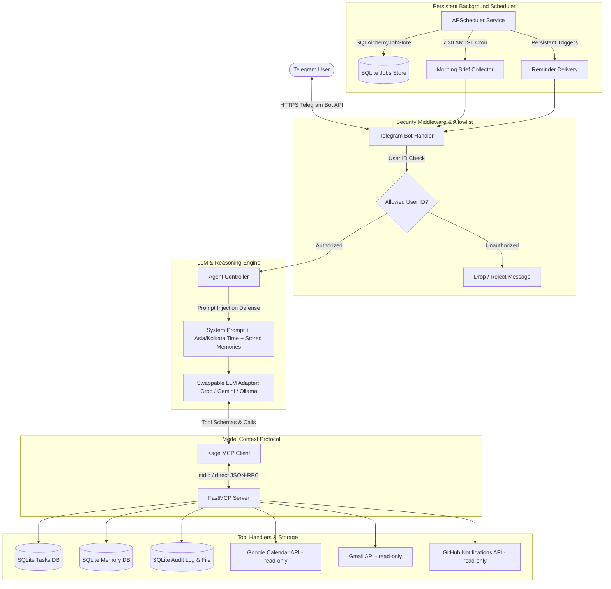

# Kage (影) — Personal Command Center Agent

A self-hosted, personal command center Telegram bot powered by an LLM with tool calling, persistent memory, and scheduled background jobs.

> **Budget**: ₹0 (100% free-tier APIs and open-source local storage).

[](tests/)
[-brightgreen.svg)](eval/)
[](LICENSE)
[](https://www.python.org/)

---

## 🌟 Capabilities

- **🌅 Morning Briefing**: Automated daily digest at 7:30 AM IST combining today's Google Calendar events, pending tasks, unread emails, and GitHub notifications. Can also be triggered on-demand via `/brief`.
- **💬 Natural Language Understanding**: Parses and resolves temporal expressions against `Asia/Kolkata` (e.g., *"remind me to review PRs tomorrow 6pm"*, *"what's due this week?"*).
- **📋 Persistent Tasks & Reminders**: Backed by SQLite and APScheduler with an SQLite `SQLAlchemyJobStore` that survives process restarts and power cycles.
- **🧠 Persistent Memory**: Remembers user facts, rules, and preferences across sessions (stored in SQLite and automatically injected into the system prompt).
- **🔌 Model Context Protocol (FastMCP)**: All 11 agent tools are exposed as an official FastMCP server (`kage-server`) and consumed by the agent through a flexible MCP client (`mode="direct"` or `mode="stdio"`).
- **🛡️ Multi-Layer Security**: Hard allowlist, read-only integrations, prompt injection defenses, and confirmation buttons for state modifications.

---

## 🏗️ Architecture



### Architecture Component Breakdown

```
+---------------------------------------------------------------------------------+
|                                 TELEGRAM USER                                   |
+----------------------------------------+----------------------------------------+
                                         |
                                         v
+---------------------------------------------------------------------------------+
|                       KAGE BOT HANDLER (python-telegram-bot)                    |
|  - @restricted Allowlist Middleware (Enforces Allowed Telegram User ID)        |
|  - Inline Confirmation Buttons (2-step verification for delete_task)            |
|  - On-Demand Commands (/start, /help, /brief)                                   |
+----------------------------------------+----------------------------------------+
                                         |
                                         v
+---------------------------------------------------------------------------------+
|                            SWAPPABLE LLM ADAPTER LAYER                          |
|  - Groq Adapter (openai/gpt-oss-120b) with automatic 429 backoff & retry       |
|  - Gemini Adapter (google-genai free tier)                                      |
|  - Temporal Context Injection (Current Date, Time & Asia/Kolkata Timezone)      |
|  - Persistent Memory Context Injection (User Preferences & Rules)              |
+----------------------------------------+----------------------------------------+
                                         |
                                         v
+---------------------------------------------------------------------------------+
|                     KAGE MCP CLIENT (Model Context Protocol)                    |
|  - Tool Discovery: Discovers tools dynamically from FastMCP server             |
|  - Schema Translation: Converts MCP inputSchema to OpenAI Function Calling      |
|  - Dual Audit Logging: Latency, tool name, args, summary to SQLite & log file    |
+----------------------------------------+----------------------------------------+
                                         |
               +-------------------------+-------------------------+
               | (direct in-process)                               | (stdio subprocess JSON-RPC)
               v                                                   v
+---------------------------------------------------------------------------------+
|                           FASTMCP SERVER (kage-server)                          |
|  - Tasks: add_task, list_tasks, complete_task, delete_task, set_reminder        |
|  - Memory: remember_fact, forget_fact, list_memories                            |
|  - Integrations: list_calendar_events, list_unread_emails, list_github_notif    |
+----------------------------------------+----------------------------------------+
                                         |
         +---------------+---------------+---------------+---------------+
         v               v                               v               v
  +--------------+ +--------------+               +--------------+ +-------------+
  | SQLite Tasks | | SQLite Memory|               | Google Cloud | | GitHub API  |
  | & Audit Logs | | & Prefs DB   |               | (Cal & Gmail)| | (Classic    |
  | (WAL mode)   | |              |               |  Read-Only)  | |  PAT)       |
  +--------------+ +--------------+               +--------------+ +-------------+
```

---

## 🔒 Security Decisions & Threat Modeling

1. **Strict User Allowlist**:
   - The bot evaluates incoming messages against `TELEGRAM_ALLOWED_USER_IDS` via the `@restricted` decorator before any processing. Messages from unauthorized users are silently dropped and logged.
2. **Read-Only External Scopes**:
   - Google OAuth credentials explicitly request read-only permissions (`calendar.readonly` and `gmail.readonly`).
   - GitHub Personal Access Token requires only `notifications` read scope. The agent cannot compose emails, alter calendars, or write to repositories.
3. **Explicit Confirmation for Destructive Actions**:
   - Tools with state side-effects (e.g., `delete_task`) enforce a two-step confirmation flow. The agent renders Telegram Inline Keyboard buttons (`✅ Confirm` / `❌ Cancel`) and will never delete items without explicit button clicks.
4. **Prompt Injection Defenses**:
   - Untrusted external text (email subject lines, snippets, GitHub notification titles) is wrapped in `[UNTRUSTED DATA]` boundary tags.
   - Content is truncated to prevent buffer or token overflow attacks.
   - The system prompt instructs the model to treat external content strictly as passive data and never follow instructions embedded inside it.
5. **Zero Hardcoded Secrets**:
   - All credentials (`TELEGRAM_BOT_TOKEN`, `GROQ_API_KEY`, `GITHUB_TOKEN`, `credentials.json`, `token.json`) are stored locally, loaded via `pydantic-settings`, and strictly excluded by `.gitignore`.
6. **SQL Injection Prevention**:
   - All database queries use parameterized SQL bindings (`?`), never string interpolation.

---

## 💰 Budget Breakdown (₹0 Spent)

| Component | Provider / Tool | Tier | Cost |
| :--- | :--- | :--- | :--- |
| **Bot Gateway** | Telegram Bot API | Standard Free Tier | ₹0 |
| **LLM Inference** | Groq Cloud (`openai/gpt-oss-120b`) | Developer Free Tier | ₹0 |
| **Alternative LLM** | Google Gemini (`gemini-2.0-flash`) | AI Studio Free Tier | ₹0 |
| **Calendar & Email** | Google Cloud Console OAuth 2.0 | Personal Desktop App | ₹0 |
| **Git Notifications**| GitHub API | Personal Access Token | ₹0 |
| **Database** | SQLite (Local file storage) | Embedded / Open Source | ₹0 |
| **Scheduling** | APScheduler with SQLite JobStore | Open Source Library | ₹0 |
| **MCP Layer** | Official FastMCP Python SDK | Open Source Protocol | ₹0 |
| **Total Cost** | | | **₹0.00** |

---

## ⚠️ Known Limitations

1. **Single User Design**: Designed as a personal sovereign command center for a single user ID, not a multi-tenant shared bot.
2. **Read-Only Communications**: By design, Kage cannot send emails or modify your calendar to avoid unintended outbound side effects.
3. **Free-Tier Rate Limits**: Groq on-demand free tier enforces an 8,000 TPM limit. Kage mitigates this using built-in exponential backoff and retry in the Groq adapter.

---

## 📊 Evaluation & Verification (Phase 7)

Kage includes a 20-scenario evaluation suite ([`eval/eval_dataset.json`](file:///d:/Coding/my-agent/eval/eval_dataset.json)) that tests natural language requests across all domains against expected tool calls.

Run the evaluation suite:
```bash
python scripts/run_eval.py
```

### Evaluation Results (Live Run on Groq `openai/gpt-oss-120b`):

```
======================================================================
 [*] KAGE AGENT TOOL-CALLING EVALUATION SUITE
======================================================================
 LLM Provider   : groq (GroqLLM)
 Total Tests    : 20
 Tools Exposed  : 11 via FastMCP
======================================================================
[01] [PASS] [tasks    ] Expected: add_task               | Actual: add_task
[02] [PASS] [tasks    ] Expected: add_task               | Actual: add_task
[03] [PASS] [tasks    ] Expected: list_tasks             | Actual: list_tasks
[04] [PASS] [tasks    ] Expected: list_tasks             | Actual: list_tasks
[05] [PASS] [tasks    ] Expected: complete_task          | Actual: complete_task
[06] [PASS] [tasks    ] Expected: delete_task            | Actual: delete_task
[07] [PASS] [reminders] Expected: set_reminder           | Actual: set_reminder
[08] [PASS] [reminders] Expected: set_reminder           | Actual: set_reminder
[09] [PASS] [reminders] Expected: set_reminder           | Actual: set_reminder
[10] [PASS] [calendar ] Expected: list_calendar_events   | Actual: list_calendar_events
[11] [PASS] [calendar ] Expected: list_calendar_events   | Actual: list_calendar_events
[12] [PASS] [email    ] Expected: list_unread_emails     | Actual: list_unread_emails
[13] [PASS] [email    ] Expected: list_unread_emails     | Actual: list_unread_emails
[14] [PASS] [github   ] Expected: list_github_notifications | Actual: list_github_notifications
[15] [PASS] [github   ] Expected: list_github_notifications | Actual: list_github_notifications
[16] [PASS] [memory   ] Expected: remember_fact          | Actual: remember_fact
[17] [PASS] [memory   ] Expected: remember_fact          | Actual: remember_fact
[18] [PASS] [memory   ] Expected: list_memories          | Actual: list_memories
[19] [PASS] [memory   ] Expected: forget_fact            | Actual: forget_fact
[20] [PASS] [chat     ] Expected: None (Direct reply)    | Actual: None (Direct reply)
======================================================================
 Passed          : 20 / 20
 Accuracy        : 100.0%
======================================================================
```

---

## 🚀 Setup & Installation Guide

### 1. Prerequisites
- Python 3.11+
- Git

### 2. Clone and Setup Environment
```bash
git clone https://github.com/aviraL27/kage.git
cd kage

python -m venv .venv
# Windows PowerShell:
.\.venv\Scripts\Activate.ps1
# Linux / macOS:
source .venv/bin/activate

pip install -r requirements.txt
```

### 3. Configure Environment Variables
Copy `.env.example` to `.env`:
```bash
cp .env.example .env
```
Fill in your configuration:
```env
TELEGRAM_BOT_TOKEN="your_bot_token_from_botfather"
TELEGRAM_ALLOWED_USER_IDS="your_telegram_numeric_id"
LLM_PROVIDER="groq"
GROQ_API_KEY="your_groq_api_key"
GROQ_MODEL="openai/gpt-oss-120b"
GITHUB_TOKEN="your_github_classic_pat"
TIMEZONE="Asia/Kolkata"
```

### 4. Authorize Google Calendar & Gmail (Read-Only)
1. In [Google Cloud Console](https://console.cloud.google.com/), create an OAuth 2.0 Desktop Client and download credentials to `credentials.json` in the project root.
2. Publish your OAuth app status to **"In production"** (so refresh tokens do not expire after 7 days).
3. Run the interactive authorization script:
```bash
python scripts/auth_google.py
```
This opens your browser, requests read-only permissions, and saves `token.json`.

### 5. Run Tests
```bash
pytest -v
```
All 34 test cases will execute and verify database persistence, scheduler triggers, allowlist security, and FastMCP client/server communication.

### 6. Start Kage Bot
```bash
python -m kage.bot.main
```

Kage will now respond to your commands in Telegram, monitor your tasks, and deliver your morning briefing every day at 7:30 AM IST!

---

## 🧪 Implementation Roadmap Status

- [x] **Phase 0**: Environment inspection, project structure, virtualenv, base repo setup.
- [x] **Phase 1**: Telegram bot skeleton with allowlist & swappable LLM adapter.
- [x] **Phase 2**: SQLite task tracking & APScheduler persistent reminders with unit tests.
- [x] **Phase 3**: Google Calendar & Gmail OAuth (read-only) + GitHub notifications.
- [x] **Phase 4**: Morning brief scheduled at 7:30 AM IST + on-demand `/brief`.
- [x] **Phase 5**: Persistent memory (user facts and preferences stored in SQLite).
- [x] **Phase 6**: FastMCP server conversion & MCP client integration.
- [x] **Phase 7**: Evaluation test suite (20 test scenarios, 100% accuracy), accuracy reporting, and complete documentation.

---

## 📜 License
MIT License. Free to use, adapt, and run locally.
